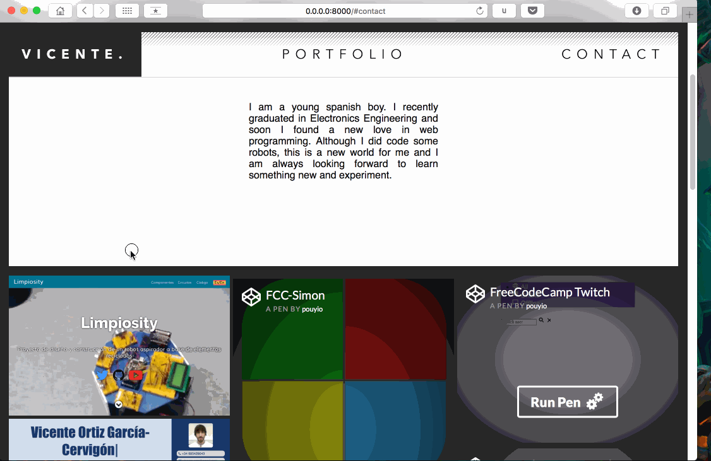

# Portfolio
My solution to [this project](https://www.freecodecamp.com/challenges/build-a-personal-portfolio-webpage) for **FreeCodeCamp**. Personal portfolio where I can show my work and contact links.

## Technical details

I used pure HTML/CSS and Javascript. I made use of [fontawesome](http://fontawesome.io) for the icons. Normalize.css included too. [Gumshoe](https://github.com/cferdinandi/gumshoe/) library for the navbar scroll spy.

Live version in [codepen.io]()

---

