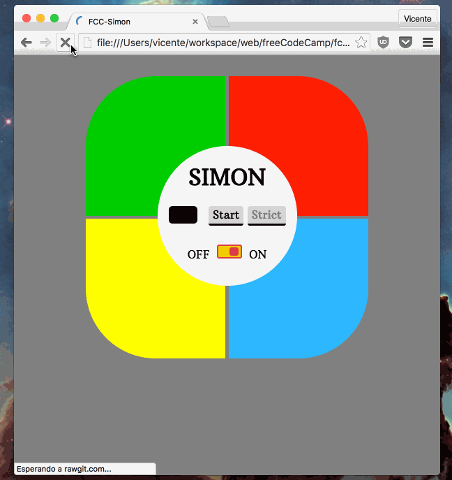

# Simon Game

My solution to the [Zipline: Build a Simon Game](http://www.freecodecamp.com/challenges/zipline-build-a-simon-game) exercise from **FreeCodeCamp**. Traditional Simon game entirely made in HTML5, CSS and Javascript.

### Instructions
To **start**  the game active global *ON/OFF* switch and press start (or just simply refresh the page). **Colors** will slightly change and everyone has its **own sound**. Once finished the series it is your turn to press the same colors in the same order. If you do right, they will sound the same, but if you press an incorrect color, a different sound will be played and your turn will end. There are **two modes** of game controlled by the *Strict* button:

- *Normal*: If you make a mistake, the series will be played again, so you can keep trying.
- *Strict*: If you fail, the series is lost and the game starts over again.

### Technical details
Apart from HTML,CSS and Javascript, I used [jQuery](https://jquery.com/) and [normalize.css](https://github.com/necolas/normalize.css). Sounds are made (original frequencies from the real game) and played with [Web Audio API](https://developer.mozilla.org/en-US/docs/Web/API/Web_Audio_API). Fonts are:
- [Artubus slab](https://www.google.com/fonts/specimen/Arbutus+Slab) from Google Fonts.
- [Digital Dream](www.pizzadude.dk) from Jakob Fischer.

Safari and Internet Explorer not supported yet due to their [Arrow functions](https://developer.mozilla.org/en-US/docs/Web/JavaScript/Reference/Functions/Arrow_functions) incompatibility. I might fix it one day. You can enjoy it in [codepen.io](http://codepen.io/pouyio/full/ZbNmOv/).

---

